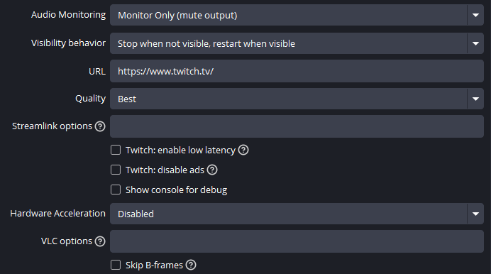

# obs-vlc-video-plugin

Modified VLC-plugin with hardware acceleration support for OBS Studio.

## Features

- Options for hardware acceleration: auto, dxva2, d3d11va, none ([avcodec-hw](https://wiki.videolan.org/Documentation:Modules/avcodec/)).
- Enable [B-frames](https://wiki.videolan.org/Frame/) skip option to reduce CPU load ([avcodec-skip-frame](https://wiki.videolan.org/Documentation:Modules/avcodec/))
- UI

</img>

## Install

> Save backup of the files before install: `vlc-video.dll`, `vlc-video.pdb`. Default path `C:\Program Files\obs-studio\obs-plugins\64bit`.

1. Download archive in [releases](https://github.com/Chimildic/obs-vlc-video-plugin/releases).
2. Unpack archive to root folder of OBS Studio. Default path `C:\Program Files\obs-studio`.

## Build

The plugin has many dependencies that not provided here. In order to build it youself, place modified files to [vlc-plugin](https://github.com/obsproject/obs-studio/tree/master/plugins/vlc-video) folder from OBS Studio repository.
