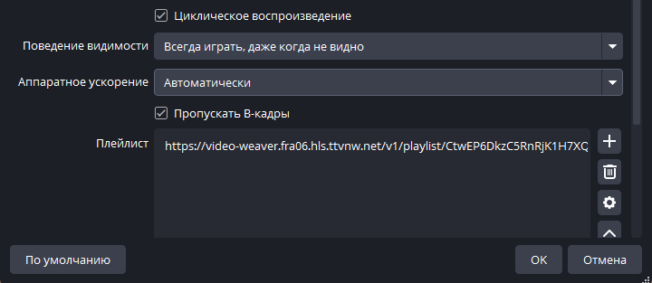

# obs-vlc-video-plugin

Модифицированный VLC-плагин для OBS Studio с поддержкой аппаратного ускорения.

## Возможности

- Для аппаратного ускорения доступны опции: автоматически, dxva2, d3d11va, отключено ([avcodec-hw](https://wiki.videolan.org/Documentation:Modules/avcodec/)).
- Для снижения нагрузки на процессор активируйте пропуск [B-кадров](https://wiki.videolan.org/Frame/) ([avcodec-skip-frame](https://wiki.videolan.org/Documentation:Modules/avcodec/))
- Настройка выведена в интерфейс плагина.

</img>

## Установка

> Перед установкой сохраните резервную копию файлов `vlc-video.dll`, `vlc-video.pdb`. Путь по умолчанию `C:\Program Files\obs-studio\obs-plugins\64bit`.

1. Скачайте архив в разделе [релизов](https://github.com/Chimildic/obs-vlc-video-plugin/releases).
2. Распакуйте содержание архива в корень папки OBS Studio. Путь по умолчанию `C:\Program Files\obs-studio`.

## Сборка

У плагина много внешних зависимостей, которых нет в этом репозитории. Для самостоятельной сборки поместите модифицированный код в папку [vlc-plugin](https://github.com/obsproject/obs-studio/tree/master/plugins/vlc-video) из репозитория OBS Studio.